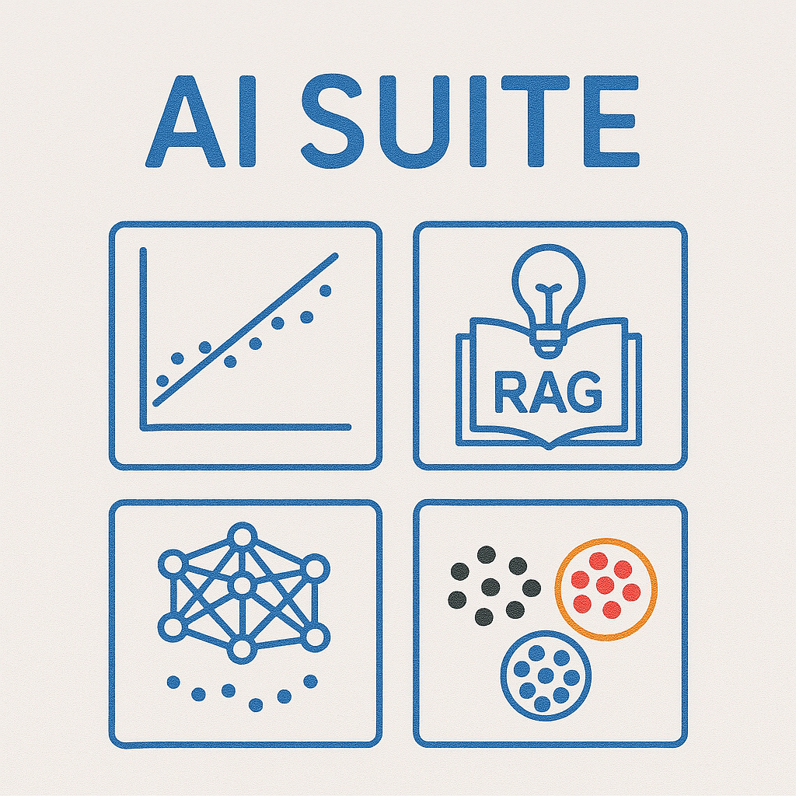
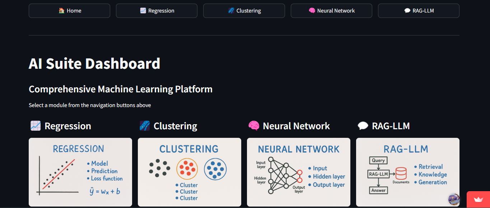

<!-- Improved compatibility of back to top link: See: https://github.com/othneildrew/Best-README-Template/pull/73 -->
<a id="readme-top"></a>


<!-- PROJECT SHIELDS -->
<!-- https://www.markdownguide.org/basic-syntax/#reference-style-links
-->
<!-- PROJECT LOGO -->
<br />
<div align="center">
  <a href="https://github.com/github_username/repo_name">
    
  </a>

<h3 align="center">Introduction to Aritifical Intelligence (CE4143/CS4241)</h3>
<h3 align="center">End-of-Semester Project Based Examination </h3>


<p align="center">
  Name: <strong>Edem Fiifi Dawson</strong><br>
  Index Number: <strong>10211100348</strong><br>
  Course: <strong>BSc Computer Engineering</strong>
</p>


  <p align="center">
    End of Semester Project based Examination for Introduction to Artificial Intelligence.
    <br />
    <a href="https://github.com/fiifidawson/ai_10211100348/tree/main/docs"><strong>Explore the docs »</strong></a>
    <br />
    <br />
    <a href="https://fiifidawsonai10211100348.streamlit.app/">View Demo</a>
    &middot;
    <a href="https://github.com/fiifidawson/ai_10211100348/issues">Report Bug</a>
  </p>
</div>


<!-- TABLE OF CONTENTS -->
<details>
  <summary>Table of Contents</summary>
  <ol>
    <li>
      <a href="#about-the-project">About The Project</a>
      <ul>
        <li><a href="#built-with">Built With</a></li>
      </ul>
    </li>
    <li>
      <a href="#getting-started">Getting Started</a>
      <ul>      
        <li><a href="#prerequisites">Prerequisites</a></li>
        <li><a href="#installation">Installation</a></li>        
      </ul>
    </li>
    <li><a href="#usage">Usage</a>
    <ul>
        <li><a href="#dashboard-overview">Dashboard Overview</a></li>
        <li><a href="#regression-module">Regression Module</a></li>
        <li><a href="#clustering-module">Clustering Module</a></li>
        <li><a href="#neural-network-module">Neural Network Module</a></li>
        <li><a href="#rag-llm-module">RAG-LLM Module</a></li>
      </ul>    
    </li> 
    <li><a href="#rag-llm-datasets-and-models-description">RAG-LLM Datasets and Models Description</a></li>
    <li><a href="#technical-report">Technical Report</a></li>
    <li><a href="#results-and-comparative-analysis">Results and Comparative Analysis</a></li>
    <li><a href="#contributing">Contributing</a></li>
    <li><a href="#license">License</a></li>
    <li><a href="#contact">Contact</a></li>
  </ol>
</details>


<!-- ABOUT THE PROJECT -->
## About The Project

<div align="center">
    
  </a>
</div>
This comprehensive AI application fulfills Academic City University's Introduction to Artificial Intelligence (CE4143/CS4241) exam requirements, providing an interactive platform for solving fundamental AI/ML problems through four integrated modules:

##### Key Features
1. **Regression Analysis**  
Predict continuous variableswith real-time performance metrics and custom input support.

2. **Smart Clustering**  
   Perform K-Means clustering with interactive 2D/3D visualizations and dynamic cluster configuration.

3. **Neural Classification**  
   Build/train feedforward networks with live training graphs and prediction capabilities.

4. **Handbook Q&A (LLM-RAG)**   
   Novel retrieval-augmented system using Gemini AI for contextual queries on Academic City's policies.

<p align="right">[<a href="#readme-top">back to top</a>]</p>


### Built With

<div align="center" style="display: flex; flex-wrap: wrap; gap: 10px; justify-content: center; align-items: center;">
  <a href="https://python.org/"></a>
  <a href="https://www.tensorflow.org/"></a>
  <a href="https://pytorch.org/"></a>
  <a href="https://python.langchain.com/"></a>
  <a href="https://huggingface.co/docs/transformers"></a>
  <a href="https://numpy.org/"></a>
  <a href="https://pandas.pydata.org/"></a>
  <a href="https://scikit-learn.org/"></a>
  <a href="https://streamlit.io/"></a>
  <a href="https://fastapi.tiangolo.com/"></a>
  <a href="https://www.trychroma.com/"></a>
  <a href="https://ai.google/"></a>
</div>

<p align="right">[<a href="#readme-top">back to top</a>]</p>


<!-- GETTING STARTED -->
## Getting Started

Follow these instructions to set up and run the project locally or in your preferred development environment.
> **_NOTE:_** This project and the setup instructions are intended for **Windows PC** users. If you're using macOS or Linux, adjust the virtual environment activation and file paths accordingly.


### Prerequisites

Before running the application, ensure you have:

- **Python 3.9, 3.10 or 3.11**
- **Git** for version control
- **Google Account** (For Gemini API access - LLM module)
- **Academic City Handbook PDF** (Placed in `data/rag_llm/` directory)
- **System Resources** (4GB RAM minimum, 8GB recommended for neural networks)

**Required Python Packages**
The required packages can be found in the requirements.txt file
```bash
requirements.txt 
```


### Installation

1. Clone the repo
   ```sh
   git clone https://github.com/fiifidawson/ai_10211100348.git
   cd ai_10211100348 # Change directory into the main project file
   ```

2. Environment Setup
   ```sh
   # Create virtual environment (Optional but recommended)
    python -m venv .venv
    ai_env\Scripts\activate  
   ```

3. Install Dependencies
    ```sh
   pip install -r requirements.txt 
   ```

4. Configure your API Key
    Get a free API Key at [Gemini-API-Key](https://ai.google.dev/gemini-api/docs/api-key)
    ```sh
    # Create a config file to store your API key
    config.py 
    ```
   ```sh
   GEMINI_API_KEY = 'ENTER YOUR API';
   ```

5. Prepare Handbook Data
   ```sh
    1. Place "ACITY_HANDBOOK.pdf" in data/rag_llm/ 
    2. First run will automatically process the PDF
   ```

6. Run the Streamlit App
   ```sh
    streamlit run app.py
   ```
<p align="right">[<a href="#readme-top">back to top</a>]</p>


<!-- USAGE EXAMPLES -->
## Usage

This section contains `clear instructions on how to use each feature`. and `a detailed description of datasets and models used` for [RAG-LLM](https://github.com/fiifidawson/ai_10211100348/tree/main/src/rag_llm) application.

Verify module functionality using these curated datasets:

- Regression Module: [salary_dataset_regression.csv](https://github.com/fiifidawson/ai_10211100348/blob/main/sample/salary_dataset_regression.csv)

- Clustering Module: [housing_price_dataset_clustering.csv](https://github.com/fiifidawson/ai_10211100348/blob/main/sample/housing_price_dataset_clustering.csv)

- Neural Network Module: [diabetes_dataset_neural_network.csv](https://github.com/fiifidawson/ai_10211100348/blob/main/sample/diabetes_dataset_neural_network.csv)


### Dashboard Overview  
The **AI Suite Dashboard** serves as the central hub for accessing all machine learning modules through an intuitive navigation bar. The homepage provides an at-a-glance overview of available features with visual preview icons for each module (Regression, Clustering, Neural Networks, and RAG-LLM).

<div align="center">
    
</div>

Users initiate tasks by 
> Clicking the desired module name in the top navigation menu  

The workflow cards show key components and an overview of the modules.

The design ensures immediate access to complex AI tools through clearly labeled controls and persistent session state management across modules. 

---
### Regression Module 
<div align="center">
  
</div> 


1. **Upload Your Data**
  Drag any CSV file with numbers [salary_dataset_regression.csv](https://github.com/fiifidawson/ai_10211100348/blob/main/sample/salary_dataset_regression.csv)

2. **Name Your Target**
    Type the column you want to predict (e.g., "Salary")

3. **Choose a Feature**
    Select what affects the price (e.g., "YearsExperience")
    Automatically handles missing numbers - choose to either:
    - Fill gaps with averages
    - Remove incomplete rows

4. **Model Configuration and Perfomence**
    Control how much data is used for testing vs training with the slider.
      Get two instant charts:
      - Trend line showing price relationships
      - Accuracy check between predictions/actual values

<div align="center">
  
</div>

5. **Predict Custom Values**
    Enter a number (e.g., 15 years of experience) to get instant salary estimates
6. **Export Everything**  
   Download:
   - Full report PDF
   - Ready-to-use prediction model
   - Cleaned dataset


---
### Clustering Module
<div align="center">
  
</div>

1. **Upload Your Data**
    Drag any CSV with customer/student/product data - Clustering Module: [housing_price_dataset_clustering.csv](https://github.com/fiifidawson/ai_10211100348/blob/main/sample/housing_price_dataset_clustering.csv)

2. **Pick Number Columns**  
   Choose 2-3 metrics like "Age" and "Purchase Frequency".
      - Choosing 2 metrics generates a 2D graph.
      - Choosing 3 metrics generates a 3D graph.

3. **Set Cluster Count**  
   Use the slider (2-10 groups)

4. **Export Everything**  
   Download:
   - Group labels CSV
   - Cluster map image
   - Full analysis report

---
### Neural Network Module 
<div align="center">
  
</div>

1. **Upload Your Data**  
   Use any CSV with categories.[diabetes_dataset_neural_network.csv](https://github.com/fiifidawson/ai_10211100348/blob/main/sample/diabetes_dataset_neural_network.csv)
2. **Choose What to Predict**  
   Name the category column (e.g., "BMI")
   
   **Column Selection**: Simplify your data by:
    - Removing irrelevant columns
    - Auto-fixing missing numbers

    Preview the data
3. **Configure your model**  
    - Select your target variable
    - Customize your AI's "brain".i.e Layers, batch size, epochs & validation set size

<div align="center">
  
</div>

4. **Train Your AI**
    Track progress with dual charts:
    - 📉 Loss reduction over time
    - 📈 Accuracy improvements


<div align="center">
  
</div>

5. **Predict New Cases**
   Either:
   - Upload test files
   - Enter numbers manually

6. **Save Your AI**  
   Download:
   - Trained model
   - Training history
   - Label translations

---
### RAG-LLM Module 
<div align="center">
  
</div>

1. **Ask Anything** 
Type your handbook-related question in the main text box and click **Submit**.

2. **Tune Results**
Control how deeply the system searches using the slider (higher = more thorough but slower).

3. **Understand Answers** 
Get instant answers with:
    - ✅ **Confidence Score**: How sure the system is (0-100%)
    - 📊 **Search Quality**: Average match score to handbook content

4. **Save History** 
    - Clear history of your questions, response & metadata
    - Save history of your questions, response & metadata

---
## RAG-LLM Datasets and Models Description 

The system utilizes the 2024 Academic City Student Handbook as its primary dataset, processed through a custom pipeline that extracts and cleans text for semantic search. Document chunks are embedded using a transformer-based model and stored in a vector database for efficient retrieval. A generative language model then produces answers based on the retrieved content, with built-in confidence scoring to enhance response transparency. This setup enables accurate, policy-grounded question answering tailored to institutional documents.

_For full details on the description of the dataset and models, please refer to the main [RAG-LLM Datasets and Models Description](https://github.com/fiifidawson/ai_10211100348/blob/main/docs/Technical_Report.md)._
<p align="right">[<a href="#readme-top">back to top</a>]</p>

<!-- USAGE EXAMPLES -->
## Technical Report 
This project features a Retrieval-Augmented Generation (RAG) system tailored for The Academic City Handbook. It uses a custom pipeline to `process PDFs`, `extract key content`, and `retrieve relevant information` for accurate answers. 
A specialized retrieval and generation setup improves response accuracy by combining document embeddings, chunking, and a Gemini-powered LLM with confidence scoring.

_For full details on the architecture, methodology, and evaluation results, please refer to the main [Technical Report](https://github.com/fiifidawson/ai_10211100348/blob/main/docs/Technical_Report.md)._
  

<p align="right">[<a href="#readme-top">back to top</a>]</p>

<!-- USAGE EXAMPLES -->
## Results and Comparative Analysis

To assess performance, the system was evaluated against ChatGPT using a curated set of policy-related questions from Academic City's official documents. The goal was to compare both models in terms of accuracy, relevance, and responsiveness when answering domain-specific queries.

Preliminary results suggest the custom RAG system provides more grounded and institution-specific responses, while ChatGPT tends to offer quicker but more generalized answers. A hybrid evaluation metric combining accuracy and specificity was used to highlight differences in performance across academic use cases.

_For a full breakdown of the analysis, please refer to the [Results and Comparative Analysis](https://github.com/fiifidawson/ai_10211100348/blob/main/docs/Results_and_Comparative_Analysis.md)._


<p align="right">[<a href="#readme-top">back to top</a>]</p>

<!-- CONTRIBUTING -->
## Contributing


If you have a suggestion that would make this better, please fork the repo and create a pull request. You can also simply open an issue with the tag "enhancement".

1. Fork the Project
2. Create your Feature Branch (`git checkout -b feature/AmazingFeature`)
3. Commit your Changes (`git commit -m 'Add some AmazingFeature'`)
4. Push to the Branch (`git push origin feature/AmazingFeature`)
5. Open a Pull Request

<p align="right">[<a href="#readme-top">back to top</a>]</p>

<!-- LICENSE -->
## License

Distributed under the [MIT License](https://choosealicense.com/licenses/mit/).

<p align="right">[<a href="#readme-top">back to top</a>]</p>


<!-- CONTACT -->
## Contact

Fiifi Dawson - [LinkedIn](https://www.linkedin.com/in/edem-dawson/)

Project Link: [ai_10211100348](https://github.com/fiifidawson/ai_10211100348)

<p align="right">[<a href="#readme-top">back to top</a>]</p>


<!-- MARKDOWN LINKS & IMAGES -->
<!-- https://www.markdowngui009688?style=for-the-badge&logo=fastapi&logoColor=white
[FastAPI-url]: https://fastapi.tiangolo.com/
[ChromaDB]: https://img.shields.io/badge/ChromaDB-32CD32?style=for-the-badge
[ChromaDB-url]: https://www.trychroma.com/
[Google-Generative-AI]: https://img.shields.io/badge/Google%20Generative%20AI-4285F4?style=for-the-badge&logo=google&logoColor=white
[Google-Generative-AI-url]: https://ai.google/

[issues-shield]: https://img.shields.io/github/issues/github_username/repo_name.svg?style=for-the-badge
[issues-url]: https://github.com/github_username/repo_name/issues
[license-shield]: https://img.shields.io/github/license/github_username/repo_name.svg?style=for-the-badge
[license-url]: https://github.com/github_username/repo_name/blob/master/LICENSE.txtde.org/basic-syntax/#reference-style-links -->
<!-- MARKDOWN LINKS & IMAGES -->
[Python]: https://img.shields.io/badge/python-3670A0?style=for-the-badge&logo=python&logoColor=ffdd54
[Python-url]: https://python.org/
[TensorFlow]: https://img.shields.io/badge/TensorFlow-FF6F00?style=for-the-badge&logo=tensorflow&logoColor=white
[TensorFlow-url]: https://www.tensorflow.org/
[PyTorch]: https://img.shields.io/badge/PyTorch-EE4C2C?style=for-the-badge&logo=pytorch&logoColor=white
[PyTorch-url]: https://pytorch.org/
[LangChain]: https://img.shields.io/badge/LangChain-00A67E?style=for-the-badge
[LangChain-url]: https://python.langchain.com/
[Transformers]: https://img.shields.io/badge/🤗%20Transformers-FF6F00?style=for-the-badge
[Transformers-url]: https://huggingface.co/docs/transformers/index
[NumPy]: https://img.shields.io/badge/Numpy-013243?style=for-the-badge&logo=numpy&logoColor=white
[NumPy-url]: https://numpy.org/
[Pandas]: https://img.shields.io/badge/Pandas-150458?style=for-the-badge&logo=pandas&logoColor=white
[Pandas-url]: https://pandas.pydata.org/
[scikit-learn]: https://img.shields.io/badge/scikit--learn-F7931E?style=for-the-badge&logo=scikit-learn&logoColor=white
[scikit-learn-url]: https://scikit-learn.org/
[Streamlit]: https://img.shields.io/badge/Streamlit-FF4B4B?style=for-the-badge&logo=streamlit&logoColor=white
[Streamlit-url]: https://streamlit.io/
[FastAPI]: https://img.shields.io/badge/FastAPI-
[product-screenshot]: images/app.png
